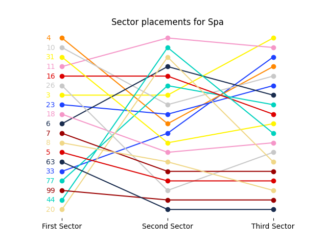

# f1_sector_times
Mocks webscraping of http://en.mclarenf-1.com/ to retrieve formula 1 sector times.

`python3 f1_sector.py --circuit spa`

|   Position |   Driver no. | Driver       |   First Sector |   Second Sector |   Third Sector | Lap Time   |
|-----------:|-------------:|:-------------|---------------:|----------------:|---------------:|:-----------|
|          1 |           11 | S Perez      |         30.697 |          46.952 |         29.097 | 1:46.746   |
|          2 |            3 | D Ricciardo  |         30.85  |          47.228 |         28.967 | 1:47.045   |
|          3 |           16 | C Leclerc    |         30.825 |          47.058 |         29.218 | 1:47.101   |
|          4 |            6 | N Latifi     |         31.061 |          47.043 |         29.191 | 1:47.295   |
|          5 |           10 | P Gasly      |         30.608 |          47.663 |         29.11  | 1:47.381   |
|          6 |            4 | L Norris     |         30.576 |          47.715 |         29.108 | 1:47.399   |
|          7 |           77 | V Bottas     |         31.325 |          47.143 |         29.215 | 1:47.683   |
|          8 |           44 | L Hamilton   |         31.505 |          46.953 |         29.275 | 1:47.733   |
|          9 |           23 | A Albon      |         30.896 |          47.689 |         29.149 | 1:47.734   |
|         10 |           31 | E Ocon       |         30.657 |          47.985 |         29.266 | 1:47.908   |
|         11 |           20 | K Magnussen  |         31.521 |          46.974 |         29.438 | 1:47.933   |
|         12 |           33 | M Verstappen |         31.316 |          47.724 |         29.104 | 1:48.144   |
|         13 |           18 | L Stroll     |         30.943 |          48.006 |         29.353 | 1:48.302   |
|         14 |           26 | D Kvyat      |         30.833 |          48.843 |         29.424 | 1:49.100   |
|         15 |            8 | R Grosjean   |         31.155 |          48.307 |         29.646 | 1:49.108   |
|         16 |            7 | K Raikkonen  |         31.131 |          48.561 |         29.502 | 1:49.194   |
|         17 |            5 | S Vettel     |         31.211 |          48.674 |         29.507 | 1:49.392   |
|         18 |           99 | A Giovinazzi |         31.465 |          50.089 |         29.903 | 1:51.457   |
|         19 |           63 | G Russell    |         31.26  |          50.272 |         29.996 | 1:51.528   |
